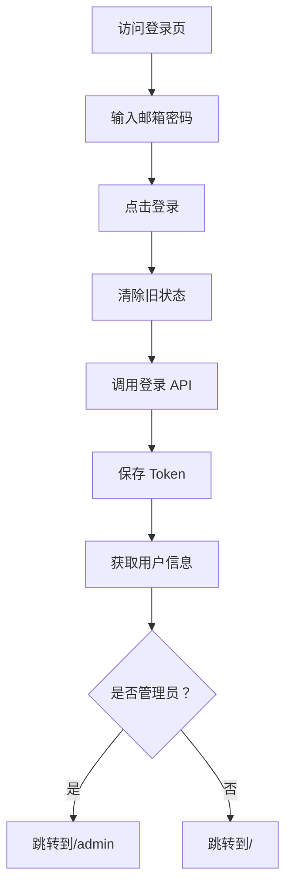
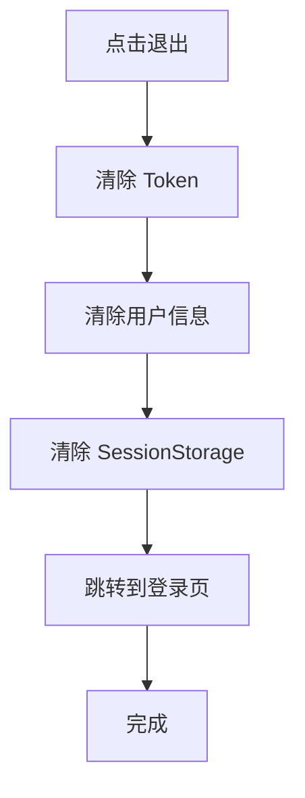
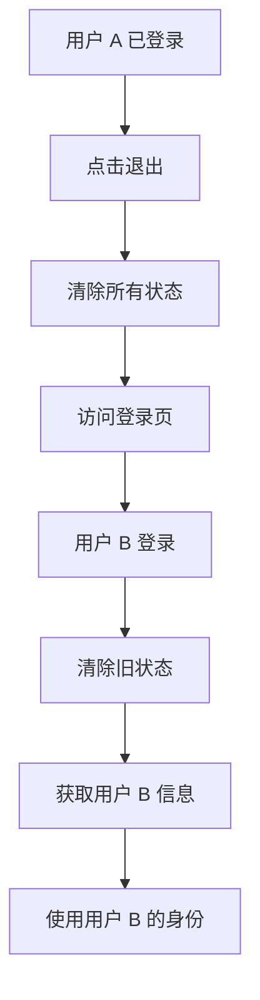

# 登录逻辑修复说明

## 问题描述

之前的登录逻辑存在以下问题：

1. **退出登录时**：只清除了 token，没有清除用户信息
2. **重新登录时**：没有先清除旧的用户信息
3. **权限判断**：可能使用了缓存的旧用户角色

## 修复内容

### 1. 修复 `store/user.js` - clearToken()

```javascript
function clearToken() {
  token.value = ''
  localStorage.removeItem('token')
  userInfo.value = null  // 清空用户信息
  
  // 同时清除 sessionStorage 中的临时数据
  sessionStorage.removeItem('user_info')
}
```

**作用**：确保退出登录时完全清除所有用户状态。

### 2. 修复 `views/common/Login.vue` - handleLogin()

```javascript
const handleLogin = async () => {
  // ...
  try {
    // 先清除旧的用户信息（重要！）
    userStore.clearToken()
    
    const res = await api.login(loginForm.email, loginForm.password)
    
    if (res.data.token) {
      userStore.setToken(res.data.token)
      // 重新获取用户信息
      await userStore.fetchUserInfo()
      
      ElMessage.success('登录成功')
      
      // 根据角色跳转
      if (userStore.isAdmin) {
        router.push('/admin')
      } else {
        router.push('/')
      }
    }
  } catch (error) {
    console.error('Login failed:', error)
  }
}
```

**作用**：每次登录前都清除旧状态，确保使用最新的用户信息。

### 3. 修复 `layouts/AdminLayout.vue` - onMounted()

```javascript
onMounted(async () => {
  // 重新获取用户信息（确保是最新的）
  await userStore.fetchUserInfo()
  
  console.log('User Info:', userStore.userInfo)
  console.log('Is Admin:', userStore.isAdmin)
  
  if (!userStore.isAdmin) {
    ElMessage.error('没有管理员权限')
    router.push('/')
  }
})
```

**作用**：添加调试日志，方便排查权限问题。

## 完整的登录流程

### 正常登录流程



### 退出登录流程



### 切换账号登录流程



## 测试步骤

### 1. 普通用户登录后切换到管理员

```bash
# 1. 用普通用户登录
email: user@example.com
password: 123456

# 2. 在数据库中将此用户设为管理员
UPDATE users SET role='admin' WHERE email='user@example.com';

# 3. 退出登录
# 点击头像 → 退出登录

# 4. 重新登录（相同账号）
# 应该自动跳转到 /admin
```

### 2. 管理员切换到普通用户

```bash
# 1. 用管理员登录
email: admin@example.com

# 2. 在数据库中改为普通用户
UPDATE users SET role='user' WHERE email='admin@example.com';

# 3. 退出并重新登录
# 应该跳转到 / （用户首页）
```

### 3. 快速切换账号

```bash
# 1. 用户 A 登录
# 2. 退出
# 3. 用户 B 登录
# 4. 检查用户信息是否为用户 B
```

## 验证方法

打开浏览器开发者工具，在 Console 中执行：

```javascript
// 查看当前用户状态
console.log('Token:', localStorage.getItem('token'))
console.log('User Info:', window.__PINIA__.state.value.user.userInfo)
console.log('Is Admin:', window.__PINIA__.state.value.user.isAdmin)
```

## 关键改进点

1. ✅ **登录前清除旧状态** - 防止角色混淆
2. ✅ **退出时完全清理** - 包括 token、userInfo、sessionStorage
3. ✅ **每次都重新获取用户信息** - 确保使用最新数据
4. ✅ **添加调试日志** - 方便排查问题

## 注意事项

⚠️ **开发时的调试技巧**：

1. 如果遇到问题，打开浏览器 Console 查看日志
2. Network 标签检查 `/v1/user/self` 的响应
3. Application → Local Storage 检查是否有残留数据
4. 必要时手动执行 `localStorage.clear()` 并刷新页面
