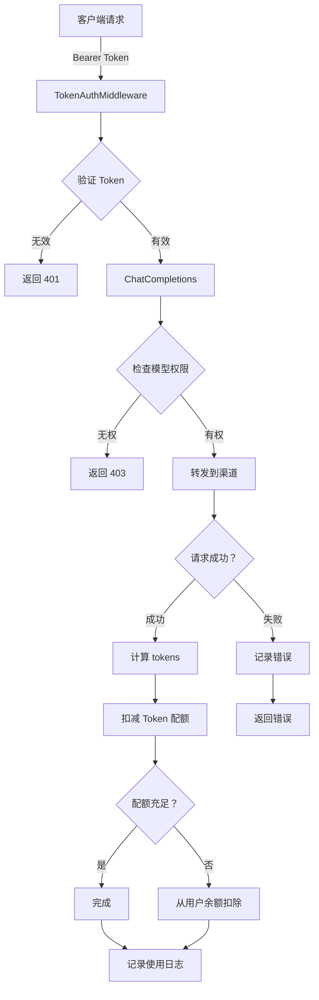

# Token 管理功能实现 - Step 2

## 完成时间
2026-04-01

## 实现内容

### 1. Token 服务层（internal/service/token.go）

创建了完整的 Token 服务，包含以下核心功能：

#### 验证功能
- `ValidateToken(ctx, tokenKey)` - 验证 Token 的有效性
  - 检查 Token 是否存在
  - 检查状态是否启用
  - 检查是否过期
  - 检查配额是否充足
  - 更新最后访问时间

- `CheckModelPermission(token, modelName)` - 检查模型权限
  - 解析 `model_limit` JSON 字段
  - 支持完全匹配
  - 支持通配符匹配（如 `gpt-*`）

#### 配额计算
- `CalculateQuota(modelName, inputTokens, outputTokens, ratio)` - 计算配额
  - 获取模型价格
  - 应用汇率倍率（ratio）
  - 转换为配额单位

- `DeductTokenQuota(ctx, token, quota)` - 扣减 Token 配额
  - 事务处理防止并发问题
  - 再次检查配额充足性
  - 原子更新 remain_quota 和 used_quota

#### 使用记录
- `RecordTokenUsage(ctx, log)` - 记录 Token 使用
- `GetTokenUsageStats(ctx, tokenKey, startTime, endTime)` - 获取使用统计

### 2. Relay 层集成（internal/handler/relay/relay.go）

#### Token 认证中间件
```go
func (h *RelayHandler) TokenAuthMiddleware() gin.HandlerFunc {
    // 1. 提取 Bearer Token
    // 2. 调用 ValidateToken 验证
    // 3. 将 Token 存入上下文
    // 4. 继续或中断请求
}
```

#### 模型权限检查
```go
func (h *RelayHandler) CheckModelPermission(c *gin.Context, modelName string) error {
    // 从上下文获取 Token
    // 调用 tokenService.CheckModelPermission
    // 返回错误（如果无权访问）
}
```

#### 配额扣减和使用记录
```go
func (h *RelayHandler) DeductQuotaAndRecord(c *gin.Context, token *model.Token, 
    modelName string, inputTokens, outputTokens int, channelID int64, 
    durationMs int, success bool, errorMsg string) {
    
    // 1. 计算配额（考虑 ratio）
    // 2. 扣减 Token 配额
    // 3. 如果失败，尝试从用户余额扣除
    // 4. 异步写入使用记录
}
```

#### ChatCompletions 方法增强
**修改前**：
- 使用用户认证中间件
- 直接扣减用户余额
- 无模型权限检查
- 无详细使用记录

**修改后**：
- 使用 Token 认证中间件
- 先检查模型权限
- 扣减 Token 配额
- 记录详细使用日志
- 支持自动续费（TODO）

### 3. 路由配置更新（cmd/server/api-router.go）

```go
func (r *APIRouter) registerRelayRoutes(v1 *gin.RouterGroup) {
    // 创建 Token 服务
    tokenService := service.NewTokenService(r.db, r.logger, r.billingService)
    
    // 创建 Relay Handler
    relayHandler := handler.NewRelayHandler(
        r.db, r.channelService, r.billingService, 
        tokenService, r.logger)
    
    relay := v1.Group("")
    {
        // 使用 Token 认证中间件
        relay.POST("/chat/completions", 
            relayHandler.TokenAuthMiddleware(), 
            relayHandler.ChatCompletions)
        
        // ... 其他端点
    }
}
```

### 4. Billing 服务扩展（internal/service/billing.go）

新增方法：
- `GetModelPrice(modelName)` - 获取模型价格（简化实现：$0.002/1K tokens）
- `GetPriceRatio()` - 获取汇率倍率（从 system_options 表读取，默认 7.2）
- `DeductUserBalance(ctx, userID, quota, reason)` - 扣减用户余额（简化版）

## 完整工作流程

### Token 使用流程



### 配额计算示例

假设：
- 模型：GPT-3.5-Turbo
- 输入：1000 tokens
- 输出：500 tokens
- Token ratio: 0.8（VIP 用户）
- 汇率：7.2

计算过程：
```javascript
// 模型价格：$0.002 / 1K tokens
base_price = (1500 / 1000) * 0.002 = $0.003

// 应用 VIP 折扣
discounted_price = $0.003 * 0.8 = $0.0024

// 转换为配额（美元 * 汇率 * 1000000）
quota = $0.0024 * 7.2 * 1000000 = 17280
```

## API 使用示例

### 1. 创建带模型限制的 Token

```bash
curl -X POST http://localhost:8080/v1/tokens \
  -H "Authorization: Bearer YOUR_USER_TOKEN" \
  -H "Content-Type: application/json" \
  -d '{
    "name": "GPT-3.5 Only",
    "remain_quota": 10000,
    "model_limit": ["gpt-3.5-turbo", "gpt-3.5-turbo-16k"],
    "ratio": 1.0
  }'
```

响应：
```json
{
  "id": 123,
  "key": "sk-abc123...",
  "message": "Token created successfully"
}
```

### 2. 使用 Token 调用 API

```bash
curl -X POST http://localhost:8080/v1/chat/completions \
  -H "Authorization: Bearer sk-abc123..." \
  -H "Content-Type: application/json" \
  -d '{
    "model": "gpt-3.5-turbo",
    "messages": [{"role": "user", "content": "Hello"}]
  }'
```

**场景分析**：

✅ **成功**：Token 配额充足且模型在允许列表中
- 扣减 Token 配额
- 记录使用日志
- 返回 API 响应

❌ **失败 1**：模型不在允许列表中
```json
{"error": "model gpt-4 is not allowed by this token"}
```

❌ **失败 2**：Token 配额不足
```json
{"error": "token has insufficient quota"}
```

### 3. 查看使用记录

```bash
curl http://localhost:8080/v1/tokens/123/usage?page=1&page_size=10 \
  -H "Authorization: Bearer YOUR_USER_TOKEN"
```

响应：
```json
{
  "items": [
    {
      "id": 1,
      "token_key": "sk-abc123...",
      "model": "gpt-3.5-turbo",
      "tokens_used": 1500,
      "quota_deducted": 17280,
      "request_time": "2026-04-01T10:00:00Z",
      "duration_ms": 234,
      "success": true,
      "input_tokens": 1000,
      "output_tokens": 500
    }
  ],
  "total": 50,
  "page": 1,
  "page_size": 10
}
```

## 数据库变更

### 已执行迁移

```sql
-- tokens 表新增字段
ALTER TABLE tokens ADD COLUMN model_limit TEXT DEFAULT '[]';
ALTER TABLE tokens ADD COLUMN ratio DECIMAL(10,6) DEFAULT 1.0;
ALTER TABLE tokens ADD COLUMN accessed_time TIMESTAMP;

-- 创建 token_usage_logs 表
CREATE TABLE token_usage_logs (
    id BIGSERIAL PRIMARY KEY,
    token_key VARCHAR(128) NOT NULL,
    user_id BIGINT NOT NULL,
    model VARCHAR(64) NOT NULL,
    tokens_used INT DEFAULT 0,
    quota_deducted INT DEFAULT 0,
    request_time TIMESTAMP NOT NULL,
    duration_ms INT DEFAULT 0,
    success BOOLEAN DEFAULT true,
    error_message VARCHAR(512),
    input_tokens INT DEFAULT 0,
    output_tokens INT DEFAULT 0,
    channel_id BIGINT
);

-- 索引
CREATE INDEX idx_token_usage_token ON token_usage_logs(token_key);
CREATE INDEX idx_token_usage_user ON token_usage_logs(user_id);
CREATE INDEX idx_token_usage_time ON token_usage_logs(request_time);
```

## 编译验证

```bash
cd /usr/local/go-path/ai-api
go build -o /tmp/ai-api-step2 ./cmd/server
# ✅ 编译成功（无错误）
```

## 下一步计划（Step 3）

### P0 - 完善功能

1. **前端界面**
   - Token 创建表单增强（添加 model_limit、ratio 字段）
   - Token 使用记录展示页面
   - 使用统计图表

2. **自动续费**
   - 实现 `checkAndAutoRenewToken` 方法
   - 添加自动续费配置
   - 记录续费日志

3. **优化性能**
   - 批量写入使用日志
   - 缓存 Token 验证结果
   - 异步处理配额扣减

### P1 - 高级功能

1. **Token 分组管理**
   - 按组统计使用情况
   - 批量操作 Token

2. **告警通知**
   - 配额不足告警
   - 异常使用检测

3. **审计日志**
   - 记录所有 Token 操作
   - 支持审计查询

## 文件清单

### 新增文件
- `internal/service/token.go` - Token 服务层（260+ 行）
- `docs/TOKEN_IMPLEMENTATION_STEP2.md` - 本文档

### 修改文件
- `internal/handler/relay/relay.go` - 集成 Token 验证（+200 行）
- `internal/service/billing.go` - 添加辅助方法
- `cmd/server/api-router.go` - 更新路由配置
- `internal/handler/index.go` - 更新构造函数

## 测试建议

### 单元测试
```bash
# TODO: 添加单元测试
go test ./internal/service/token_test.go
go test ./internal/handler/relay/relay_test.go
```

### 集成测试
1. 创建不同配置的 Token
2. 测试模型权限控制
3. 测试配额扣减逻辑
4. 测试使用记录写入

### 压力测试
- 并发 Token 验证
- 高并发配额扣减
- 大量使用日志写入

## 注意事项

⚠️ **生产环境部署前必须完成**：

1. **数据库迁移**：执行 `scripts/migrate_tokens.sql`
2. **配置汇率**：在 system_options 表中插入 price 配置
3. **监控告警**：设置配额不足告警
4. **备份策略**：定期备份 token_usage_logs 表
5. **性能优化**：根据实际负载调整索引和缓存策略

## 参考资源

- [Step 1 文档](./TOKEN_IMPLEMENTATION_STEP1.md)
- [功能规划](./TOKEN_FEATURE_PLAN.md)
- [new-api 参考实现](https://github.com/QuantumNous/new-api)
